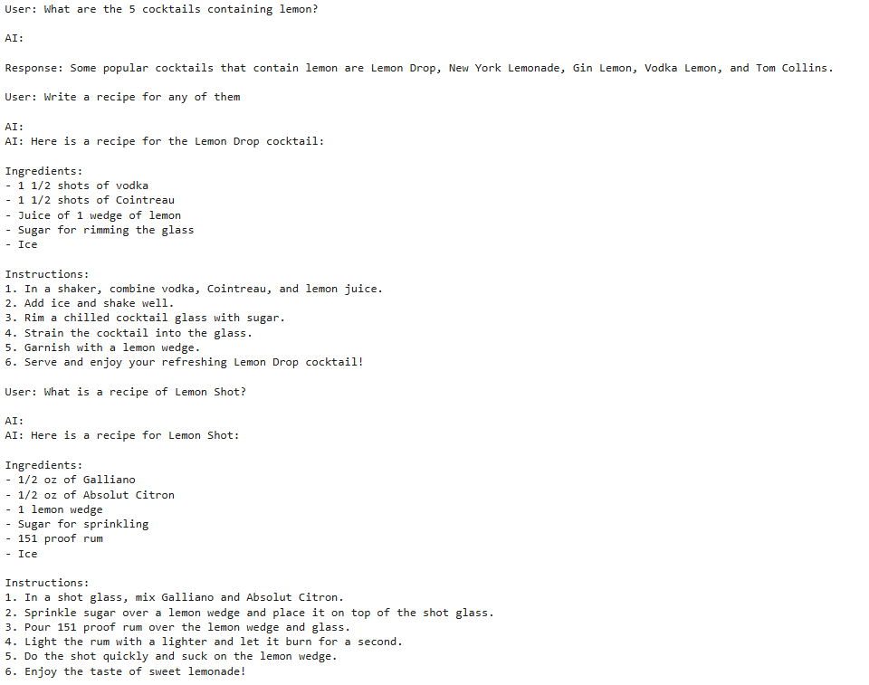

# RAG-based Conversational Bartender Chatbot
A video demo showcasing the chatbot's functionality: 
[https://youtu.be/68X_zq9tYIE](https://youtu.be/bcs91_XYPFU)

This project implements a Retrieval-Augmented Generation (RAG) conversational chatbot designed to provide cocktail recommendations and recipes based on user input. The bot is equipped with memory to maintain context throughout a conversation, making interactions seamless and dynamic.

## Features
- **Cocktail Recommendations**: Suggests cocktails based on user preferences.
- **Recipe Generation**: Provides detailed recipes for requested cocktails.
- **Contextual Memory**: Maintains conversation history for context-aware responses.
- **RAG Architecture**: Combines retrieval-based and generative AI techniques for accurate and dynamic responses.

## Technology Stack
- **Programming Language**: Python
- **Frameworks & Libraries**:
  - Gradio: For building the interactive user interface.
  - LangChain: For implementing RAG-based logic and conversational memory.
  - OpenAI API: For generative language model capabilities.
  - Hugging Face Transformers: For embedding generation and text processing.
  - FAISS & Chroma: For vector storage and similarity search.

## Setup Instructions

### Prerequisites
- Python 3.8 or higher
- An OpenAI API key

## Usage
- **Ask for recommendations**:
  - Example: "What are some cocktails containing rum?"
- **Request recipes**:
  - Example: "Can you give me the recipe for a Mojito?"
- **Explore variations**:
  - Example: "What cocktails can I make with vodka and lemon?"

## Example of Work in the Notebook (Screenshots)

Here is a screenshot demonstrating the chatbot in action (using terminal):

## Acknowledgments
- OpenAI for providing GPT-based capabilities.
- Hugging Face for their robust NLP tools.
- LangChain for seamless RAG and memory integration.

